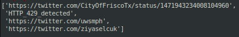
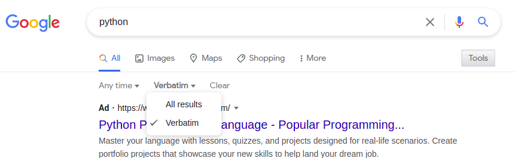
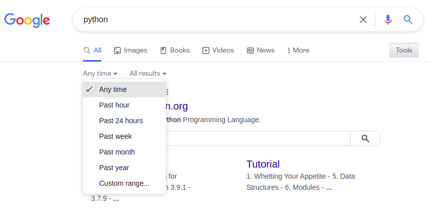

# yagooglesearch - Yet another googlesearch

## Overview

`yagooglesearch` is a Python library for executing intelligent, realistic-looking, and tunable Google searches.  It
simulates real human Google search behavior to prevent rate limiting by Google (the dreaded HTTP 429 response), and if
HTTP 429 blocked by Google, logic to back off and continue trying.  The library does not use the Google API and is
heavily based off the [googlesearch](https://github.com/MarioVilas/googlesearch) library.  The features include:

* Tunable search client attributes mid searching
* Returning a list of URLs instead of a generator
* HTTP 429 / rate-limit detection (Google is blocking your IP for making too many search requests) and recovery
* Randomizing delay times between retrieving paged search results (i.e., clicking on page 2 for more results)
* HTTP(S) and SOCKS5 proxy support
* Leveraging `requests` library for HTTP requests and cookie management
* Adds "&filter=0" by default to search URLs to prevent any omission or filtering of search results by Google
* Console and file logging
* Python 3.6+

## Terms and Conditions

This code is supplied as-is and you are fully responsible for how it is used.  Scraping Google Search results may
violate their [Terms of Service](https://policies.google.com/terms).  Another Python Google search library had some
interesting information/discussion on it:

* [Original issue](https://github.com/aviaryan/python-gsearch/issues/1)
* [A response](https://github.com/aviaryan/python-gsearch/issues/1#issuecomment-365581431>)
* Author created a separate [Terms and Conditions](https://github.com/aviaryan/python-gsearch/blob/master/T_AND_C.md)
* ...that contained link to this [blog](https://benbernardblog.com/web-scraping-and-crawling-are-perfectly-legal-right/)

Google's preferred method is to use their [API](https://developers.google.com/custom-search/v1/overview).

## Installation

## pip

```bash
pip install yagooglesearch
```

## <span>setup.py</span>

```bash
git clone https://github.com/opsdisk/yagooglesearch
cd yagooglesearch
virtualenv -p python3.7 .venv  # If using a virtual environment.
source .venv/bin/activate  # If using a virtual environment.
python setup.py install
```

## Usage

```python
import yagooglesearch

query = "site:github.com"

client = yagooglesearch.SearchClient(
    query,
    tbs="li:1",
    max_search_result_urls_to_return=100,
    http_429_cool_off_time_in_minutes=45,
    http_429_cool_off_factor=1.5,
    # proxy="socks5h://127.0.0.1:9050",
    verbosity=5,
    verbose_output=True,  # False (only URLs) or True (rank, title, description, and URL)
)
client.assign_random_user_agent()

urls = client.search()

len(urls)

for url in urls:
    print(url)
```

## Google is blocking me!

Low and slow is the strategy when executing Google searches using `yagooglesearch`.  If you start getting HTTP 429
responses, Google has rightfully detected you as a bot and will block your IP for a set period of time. `yagooglesearch`
is not able to bypass CAPTCHA, but you can do this manually by performing a Google search from a browser and proving you
are a human.

The criteria and thresholds to getting blocked is unknown, but in general, randomizing the user agent, waiting enough
time between paged search results (7-17 seconds), and waiting enough time between different Google searches (30-60
seconds) should suffice.  Your mileage will definitely vary though.  Using this library with Tor will likely get you
blocked quickly.

## HTTP 429 detection and recovery (optional)

If `yagooglesearch` detects an HTTP 429 response from Google, it will sleep for `http_429_cool_off_time_in_minutes`
minutes and then try again.  Each time an HTTP 429 is detected, it increases the wait time by a factor of
`http_429_cool_off_factor`.

The goal is to have `yagooglesearch` worry about HTTP 429 detection and recovery and not put the burden on the script
using it.

If you do not want `yagooglesearch` to handle HTTP 429s and would rather handle it yourself, pass
`yagooglesearch_manages_http_429s=False` when instantiating the yagooglesearch object.  If an HTTP 429 is detected, the
string "HTTP_429_DETECTED" is added to a list object that will be returned, and it's up to you on what the next step
should be.  The list object will contain any URLs found before the HTTP 429 was detected.

```python
import yagooglesearch

query = "site:twitter.com"

client = yagooglesearch.SearchClient(
    query,
    tbs="li:1",
    verbosity=4,
    num=10,
    max_search_result_urls_to_return=1000,
    minimum_delay_between_paged_results_in_seconds=1,
    yagooglesearch_manages_http_429s=False,  # Add to manage HTTP 429s.
)
client.assign_random_user_agent()

urls = client.search()

if "HTTP_429_DETECTED" in urls:
    print("HTTP 429 detected...it's up to you to modify your search.")

    # Remove HTTP_429_DETECTED from list.
    urls.remove("HTTP_429_DETECTED")

    print("URLs found before HTTP 429 detected...")

    for url in urls:
        print(url)
```



## HTTP and SOCKS5 proxy support

`yagooglesearch` supports the use of a proxy.  The provided proxy is used for the entire life cycle of the search to
make it look more human, instead of rotating through various proxies for different portions of the search.  The general
search life cycle is:

1) Simulated "browsing" to `google.com`
2) Executing the search and retrieving the first page of results
3) Simulated clicking through the remaining paged (page 2, page 3, etc.) search results

To use a proxy, provide a proxy string when initializing a `yagooglesearch.SearchClient` object:

```python
client = yagooglesearch.SearchClient(
    "site:github.com",
    proxy="socks5h://127.0.0.1:9050",
)
```

Supported proxy schemes are based off those supported in the Python `requests` library
(<https://docs.python-requests.org/en/master/user/advanced/#proxies>):

* `http`
* `https`
* `socks5` - "causes the DNS resolution to happen on the client, rather than on the proxy server."  You likely **do
  not** want this since all DNS lookups would source from where `yagooglesearch` is being run instead of the proxy.
* `socks5h` - "If you want to resolve the domains on the proxy server, use socks5h as the scheme."  This is the **best**
  option if you are using SOCKS because the DNS lookup and Google search is sourced from the proxy IP address.

## HTTPS proxies and SSL/TLS certificates

If you are using a self-signed certificate for an HTTPS proxy, you will likely need to disable SSL/TLS verification when
either:

1) Instantiating the `yagooglesearch.SearchClient` object:

```python
import yagooglesearch

query = "site:github.com"

client = yagooglesearch.SearchClient(
    query,
    proxy="http://127.0.0.1:8080",
    verify_ssl=False,
    verbosity=5,
)
```

2) or after instantiation:

```python
query = "site:github.com"

client = yagooglesearch.SearchClient(
    query,
    proxy="http://127.0.0.1:8080",
    verbosity=5,
)

client.verify_ssl = False
```

## Multiple proxies

If you want to use multiple proxies, that burden is on the script utilizing the `yagooglesearch` library to instantiate
a new `yagooglesearch.SearchClient` object with the different proxy. Below is an example of looping through a list of
proxies:

```python
import yagooglesearch

proxies = [
    "socks5h://127.0.0.1:9050",
    "socks5h://127.0.0.1:9051",
    "http://127.0.0.1:9052",  # HTTPS proxy with a self-signed SSL/TLS certificate.
]

search_queries = [
    "python",
    "site:github.com pagodo",
    "peanut butter toast",
    "are dragons real?",
    "ssh tunneling",
]

proxy_rotation_index = 0

for search_query in search_queries:

    # Rotate through the list of proxies using modulus to ensure the index is in the proxies list.
    proxy_index = proxy_rotation_index % len(proxies)

    client = yagooglesearch.SearchClient(
        search_query,
        proxy=proxies[proxy_index],
    )

    # Only disable SSL/TLS verification for the HTTPS proxy using a self-signed certificate.
    if proxies[proxy_index].startswith("http://"):
        client.verify_ssl = False

    urls_list = client.search()

    print(urls_list)

    proxy_rotation_index += 1
```

## GOOGLE_ABUSE_EXEMPTION cookie

If you have a `GOOGLE_ABUSE_EXEMPTION` cookie value, it can be passed into `google_exemption` when instantiating the
`SearchClient` object.

## &tbs= URL filter clarification

The `&tbs=` parameter is used to specify either verbatim or time-based filters.

### Verbatim search

```none
&tbs=li:1
```



### time-based filters

| Time filter | &tbs= URL parameter                   | Notes                                 |
| ----------- | ------------------------------------- | ------------------------------------- |
| Past hour   | qdr:h                                 |                                       |
| Past day    | qdr:d                                 | Past 24 hours                         |
| Past week   | qdr:w                                 |                                       |
| Past month  | qdr:m                                 |                                       |
| Past year   | qdr:y                                 |                                       |
| Custom      | cdr:1,cd_min:1/1/2021,cd_max:6/1/2021 | See yagooglesearch.get_tbs() function |



## Limitations

Currently, the `.filter_search_result_urls()` function will remove any url with the word "google" in it.  This is to
prevent the returned search URLs from being polluted with Google URLs.  Note this if you are trying to explicitly search
for results that may have "google" in the URL, such as `site:google.com computer`

## License

Distributed under the BSD 3-Clause License. See [LICENSE](./LICENSE) for more information.

## Contact

[@opsdisk](https://twitter.com/opsdisk)

Project Link: [https://github.com/opsdisk/yagooglesearch](https://github.com/opsdisk/yagooglesearch)

## Acknowledgements

* [Mario Vilas](https://github.com/MarioVilas) for his amazing work on the original
  [googlesearch](https://github.com/MarioVilas/googlesearch) library.

## Contributors

* [KennBro](https://github.com/KennBro) - <https://github.com/opsdisk/yagooglesearch/pull/9>
* [ArshansGithub](https://github.com/ArshansGithub) - <https://github.com/opsdisk/yagooglesearch/pull/21>
* [pguridi](https://github.com/pguridi) - <https://github.com/opsdisk/yagooglesearch/pull/38>